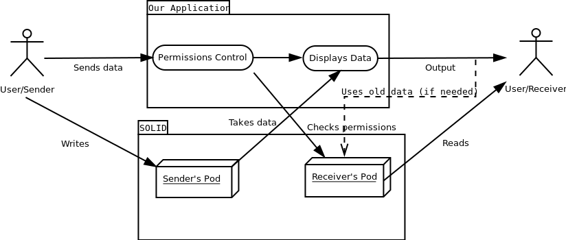
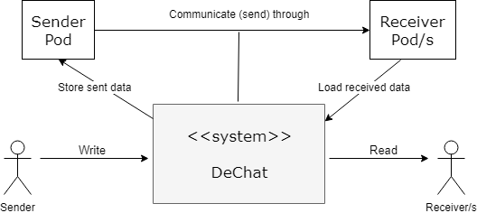

[[section-system-scope-and-context]]
= System Scope and Context

== What are the goals of the system?

The main idea of this project is to create a decentralised chat, in other words, we are creating an application capable of conecting to SOLID and allow their users to communicate between them. In order to be a decentralised chat we use SOLID's pods. The whole idea is using our application
as a point where you can access your data stored in SOLID and manage it in order to send messages and other data to other users. Our application is completely transparent to the user and SOLID as we don't store any user informatio, we just allow them to send it. Also our applicatio is completely compatible with the
existing SOLID chat avaible making our application also capable of interact with the orginal chat available on the platform.

=== Use case

      
The communication is done through the user's pods. Everytime a user sends a mesage it is communicated to his/her pod and then that change is notifiyed to the other user De-chat, that is when the read of the pod is done. As we can see all the data is stored safely on the pods and can be
deleared at any time by the user.

== Business Context

This section shows a representation of the communication partners and stakeholders in our system, offering a graphic view of the business and technical context of it and specifying its external interfaces.

Simple diagram representing the business context:

.DeChat
[%header, cols="2, 5, 5"]
|===
|Name|Inputs|Outputs
|Sender|None|Messages (to DeChat)
|DeChat (Sender part)|Sent messages (from Sender)|New data (to Sender Pod), Sent messages (to Receiver Pod inbox)
|Sender Pod|New data (from DeChat)|None
|Receiver Pod|Messages (from sender DeChat)|Messages (to receiver DeChat)
|DeChat (Receiver part)|Received messages (from Receiver Pod)|Received messages (show visually to Receiver)
|Receiver|Received messages (from DeChat)|None
|===

== Technical Context

For this application we are using a bunch of techlogies, such as SOLID, Angular, TypeScript ... The idea is building with these resources a working application that allows SOLID users to communicate between then, for this purpose we use WebRTC to send the messages. We also use SOLID authentication
services and some other libraries in order manage the pods for reading and writing the data there. Algular framework is used for simplicity as it is a one page application. 

