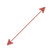

[[section-building-block-view]]

== Building Block View

.Major view of the system:
[caption="Global Scope"]
image::images/05_Major_Scope[]

.Legend
===
Item | Meaning 
 | Information being transmitted
 | User
 | User's POD
===

.Message management:
[caption="Level 1 Scope"]
image::images/05_Level1[]

.Legend
===
Item | Meaning 
 | Information being transmitted
 | User
 | User's POD
 | Document generated
===