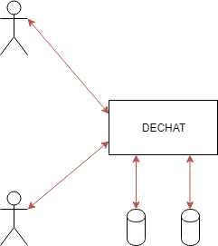
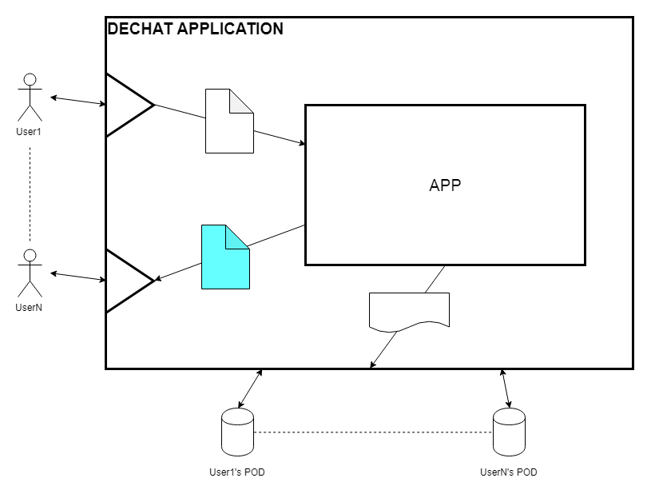
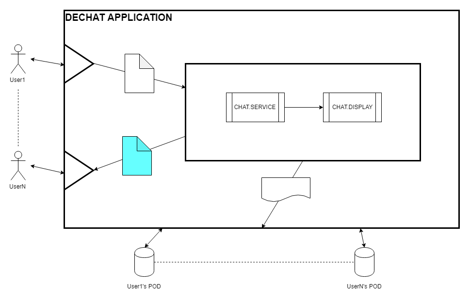

[[section-building-block-view]]

== Building Block View

We will have a block based view of the application, decomposing into a higher technical view.

.Major view of the system: +
  

.Legend
[options="header",cols="1a,2"]
|===
|Item | Meaning 
|image::images/Arrow.png[] | Information being transmitted.
|image::images/user.png[] | User of the application.
|image::images/user_pod.png[] | User's POD.
|===

We will begin unveiling the application's parts.

.Message/Notification management: +

.Legend
[options="header",cols="1a,2"]
|===
|Item | Meaning 
|image::images/Arrow.png[] | Information being transmitted.
|image::images/user.png[] | User of the application.
|image::images/user_pod.png[] | User's POD.
|image::images/Message.png[] | Message being sent by the user.
|image::images/MessageNot.png[] | Notification of the message being sent to the recievers.
|image::images/doc.png[] | Information being sent to the owner of the conversation POD.
|===

.Inside of the application: +

.Legend
[options="header",cols="1a,2"]
|===
|Item | Meaning 
|image::images/Arrow.png[] | Information being transmitted.
|image::images/user.png[] | User of the application.
|image::images/user_pod.png[] | User's POD.
|image::images/Message.png[] | Message being sent by the user.
|image::images/MessageNot.png[] | Notification of the message being sent to the recievers. Also contains the message.
|image::images/doc.png[] | Information being sent to the owner of the conversation POD.
|image::images/Process.png[] | Process being done inside the application.
|===