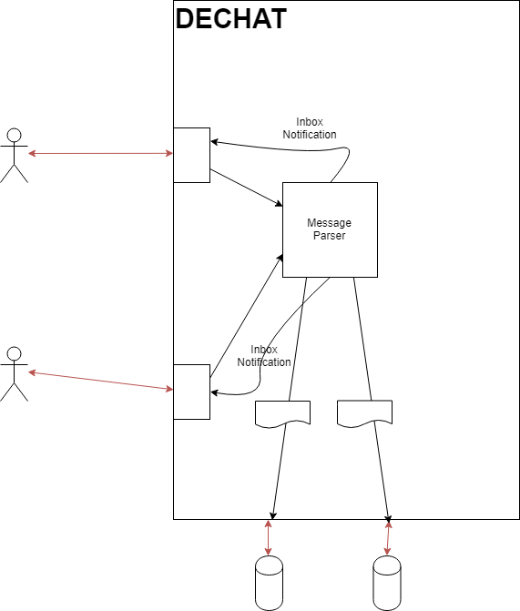

[[section-building-block-view]]

== Building Block View

.Major view of the system: +
image::images/05_Major_Scope.png[]

.Legend
[options="header",cols="1,2"]
|===
|Item | Meaning 
|image::images/red_arrow.png[] | Information being transmitted
|image::images/user.png[] | User
|image::images/user_pod.png[] | User's POD
|===

.Message management: +

.Legend
[options="header",cols="1,2"]
|===
|Item | Meaning 
|image::images/red_arrow.png[] | Information being transmitted
|image::images/user.png[] | User
|image::images/user_pod.png[] | User's POD
|image::images/doc.png[] | Document generated
|===