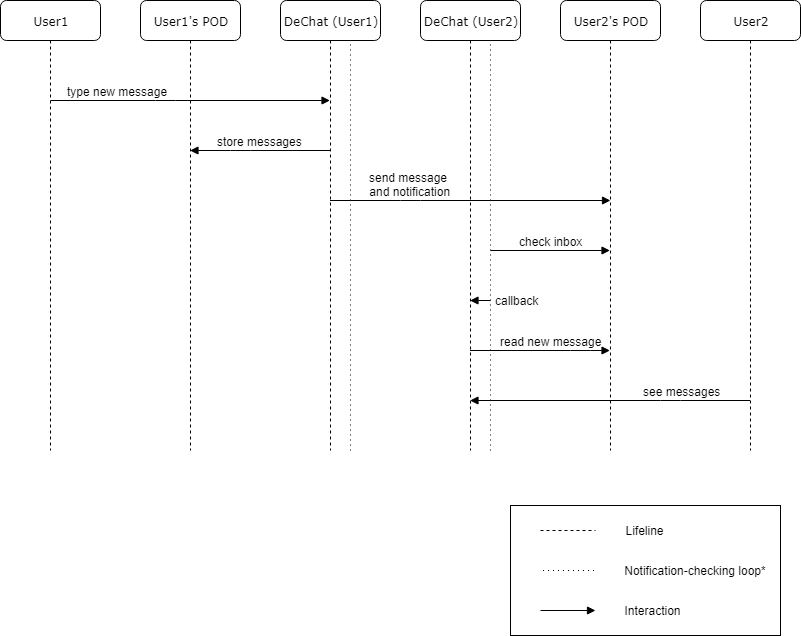
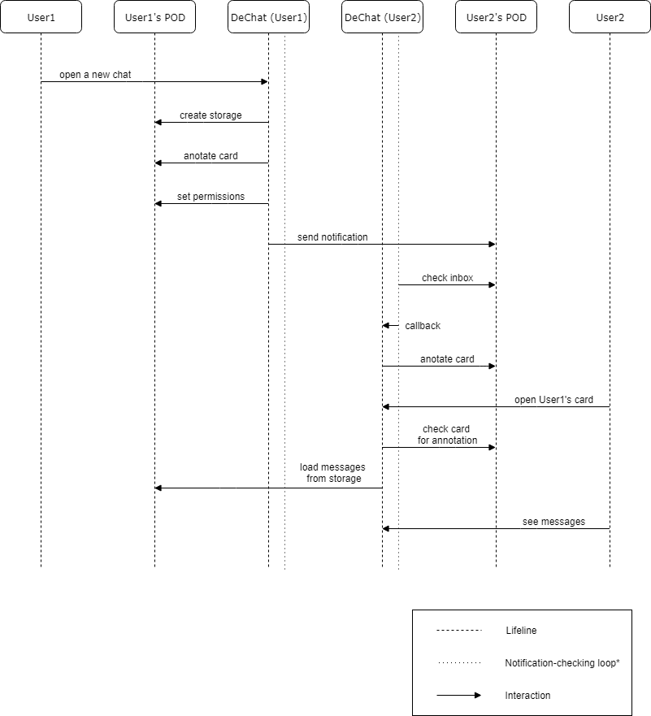

[[section-runtime-view]]
== Runtime View

This section will offer a view of the system at runtime in different scenarios, representing the flow in time of the various interactions between the building blocks of our system.

First of all, in a one-to-one text message scenario, the user that wishes to send a message would type into the DeChat application. 

The application would then store the new messages in the user's personal storage, namely his/her POD (creating and configuring its permissions if a storage for the chat does not exist yet). It would also send the data to the receiver's user inbox and a notification that someone has sent a message. 

The application of the receiver would be constantly checking the inbox for notifications (*) until it finds the notification of a new message. Then, the application would read the message from the receiver's inbox and show it. 

The receiver would then be able to read the messages and the process would be finished.

=== When the chat already exists:

Here is a sequence diagram representing the runtime process of sending a message to an already existing chat:

=== When creating a new chat:

This sequence diagram represents the process of creating a new chat:

