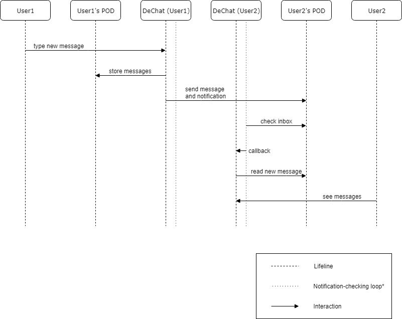

[[section-runtime-view]]
== Runtime View

This section will offer a view of the system at runtime, representing the flow in time of the different interactions between the building blocks of our system.

First of all, in a one-to-one text message scenario, the user that wishes to send a message would type into the DeChat application. 

The application would then store the new messages in the user's personal storage, namely his/her POD. It would also send the data to the receiver's user inbox and a notification that someone has sent a message. 

The receiver user would check the application for new messages, so it would read the inbox and load the conversation in order to show it to the user. The receiver user would read the messages and the process would be finished.

Here is a sequence diagram representing the runtime process:

*TO-DO*