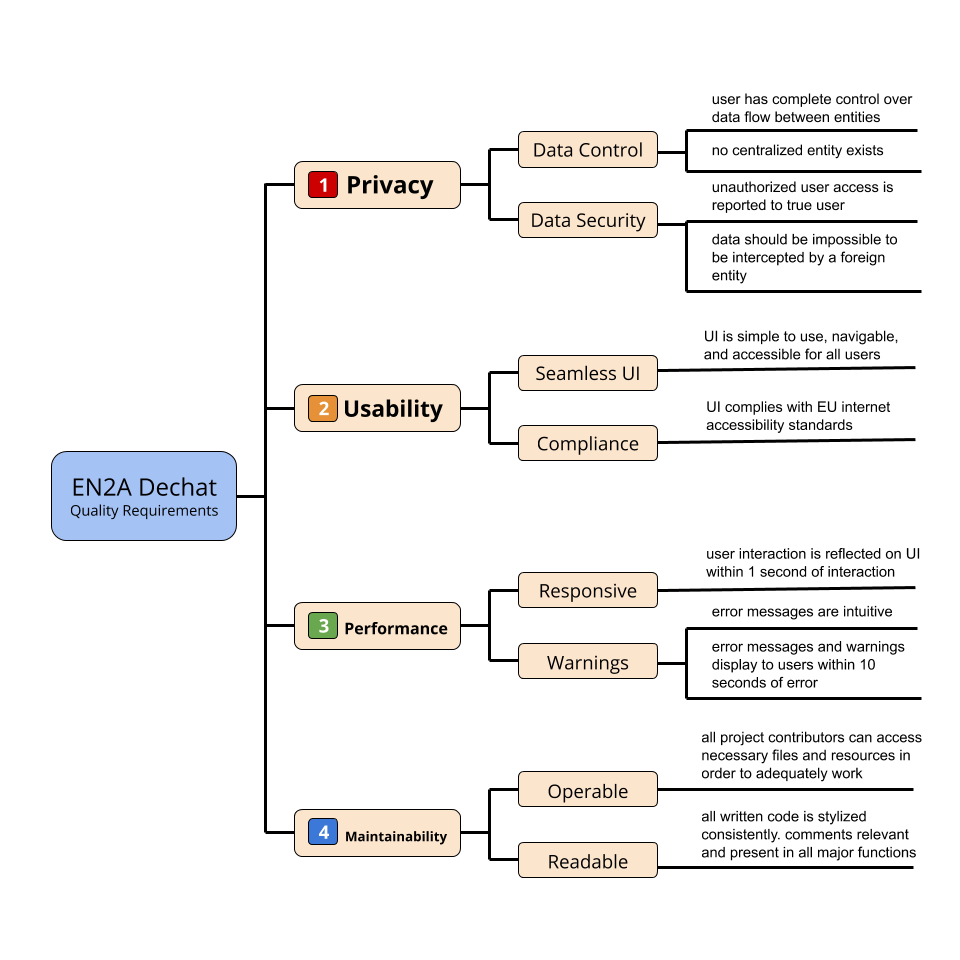

[[section-quality-scenarios]]
== Quality Requirements

=== Quality Requirements Tree

[role="arc42help"]
****
Below is a tree representing the quality requirements and their specifications for the project. 

[role="arc42help"]
****
=== Quality Scenarios

[%header, cols="2, 2, 2, 2, 2, 2, 2"]
|===
|Quality Type|Source of Stimulus|Stimulus|Artifact|Environment|Response|Response Measure
|Availability|Internet Connection|Internet connection failure|Communication channel|Normal environment|Save data state|Data is recovered and available upon internet reconnection
|===

****

